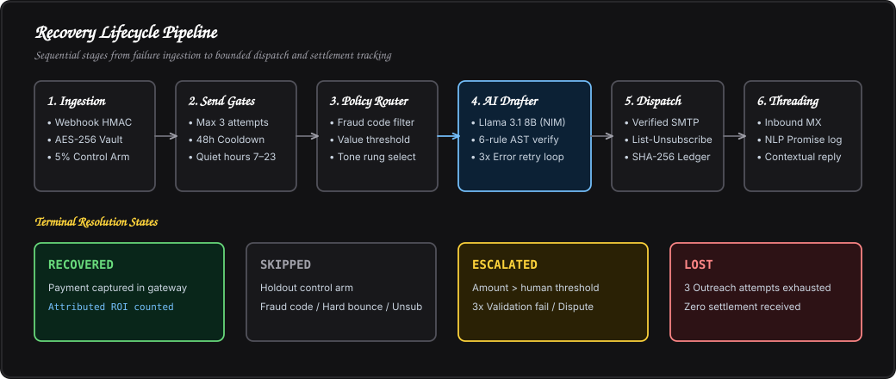
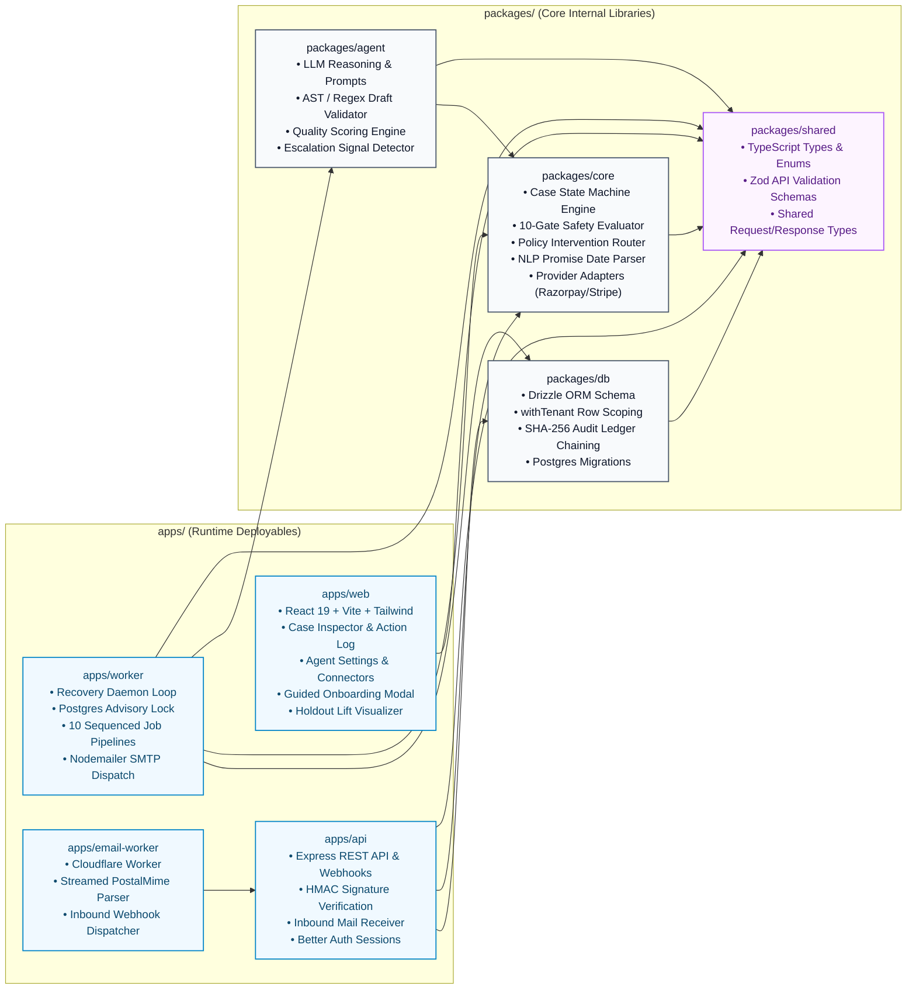
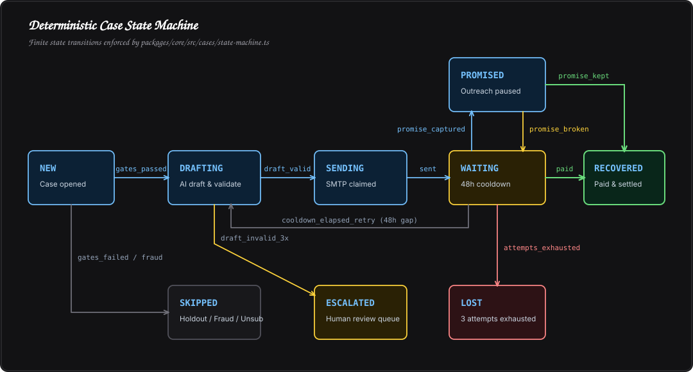
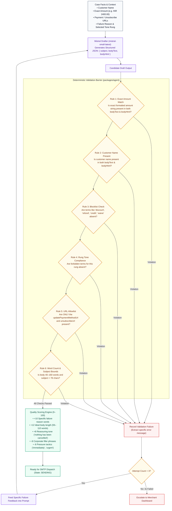
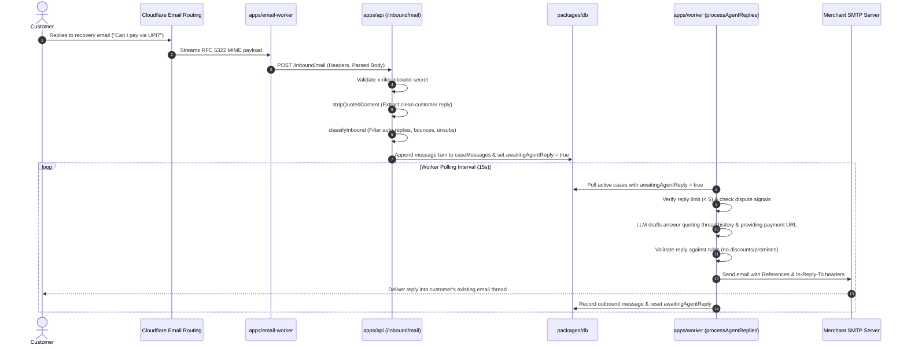
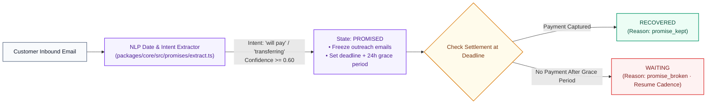
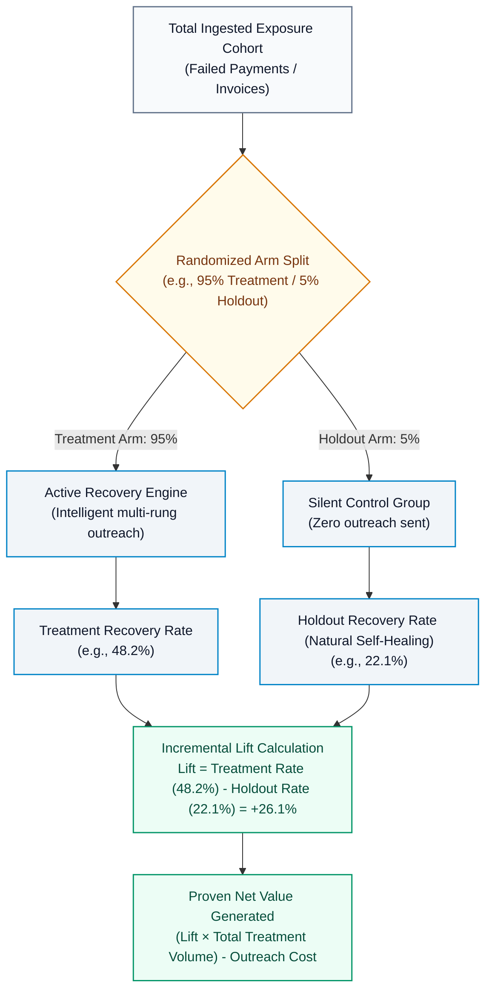
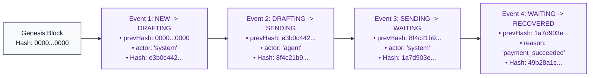

# How Riko Works

Riko is an autonomous revenue recovery engine. It detects payment failures, abandoned checkouts, and overdue receivables, decides whether and when to act, and runs bounded email outreach to recover funds. The merchant sets the bounds — the agent works inside them, and code makes sure it stays that way.

---

## 1. System Architecture & Topology

Riko separates recovery policy from message generation. A deterministic policy engine evaluates limits and safety bounds, while an LLM reasoning engine drafts messages within structured templates. Every draft is evaluated by a post-generation validation pass before dispatch.

---

## 2. End-to-End Recovery Event Lifecycle

Every payment failure, cart abandonment, or invoice due event moves through an end-to-end processing pipeline:

---

## 3. Core Monorepo Architecture

---

## 4. Case State Machine

Cases move through a finite state machine enforced by [`packages/core/src/cases/state-machine.ts`](./packages/core/src/cases/state-machine.ts).

### State Definitions & Transitions

| From State | Trigger | To State | Reason |
|---|---|---|---|
| `NEW` | `gates_passed` | `DRAFTING` | Eligible for outreach |
| `NEW` | `gates_failed` | `SKIPPED` | Holdout, fraud code, or quiet hours |
| `NEW` | `payment_succeeded` | `RECOVERED` | Paid immediately |
| `DRAFTING` | `draft_valid` | `SENDING` | Draft passed all AST validation rules |
| `DRAFTING` | `draft_invalid_exhausted` | `ESCALATED` | Failed validation 3x |
| `SENDING` | `sent` | `WAITING` | Dispatched via SMTP; 48h cooldown begins |
| `WAITING` | `promise_captured` | `PROMISED` | Customer committed to future date |
| `WAITING` | `cooldown_elapsed_retry` | `DRAFTING` | 48h elapsed and attempt count < 3 |
| `WAITING` | `cooldown_elapsed_exhausted`| `LOST` | 3 outreach attempts exhausted |
| `WAITING` | `customer_replied` | `ESCALATED` | Dispute or unhandled customer intent |
| `WAITING` | `customer_unsubscribed` | `SKIPPED` | Opted out via one-click link |
| `PROMISED` | `payment_succeeded` | `RECOVERED` | Promise kept by customer |
| `PROMISED` | `promise_broken` | `WAITING` | Grace period elapsed without settlement |
| `ANY` | `payment_succeeded` | `RECOVERED` | Payment captured in gateway |

---

## 5. Send Gates & Policy Engine

Before any draft is generated, [`packages/core/src/gates/evaluate.ts`](./packages/core/src/gates/evaluate.ts) executes hard safety checks. The numbers below are per-tenant defaults — attempt caps, cooldowns, contact window, age limits, and a minimum-amount floor are all editable under Settings → Agent, and the gate code enforces whatever the merchant set with the same rigidity:

---

## 6. AI Reasoning, Drafting & AST Validation

The merchant shapes the voice; the validator keeps the promises. Tone and persistence preferences, high-value flags, and standing written guidance are injected into the prompt as advisory context — sanitized of markup and explicitly subordinate to the rules — while the validation barrier below stays identical no matter what a merchant writes.

### Communication Tone Rungs
- `instrument_fix`: Friendly notification for soft declines, expired cards, or authentication issues.
- `resume_checkout`: Cart abandonment nudge with a saved checkout link (no debt framing).
- `reminder`: First gentle reminder for overdue invoices.
- `firm`: Professional follow-up on persistent unpaid invoices.
- `formal`: Late-stage invoice notice stating outstanding amounts plainly.
- `merchant_fault`: Transparent notice for merchant gateway configuration issues.

---

## 7. Two-Way Email & Conversation Threading

---

## 8. Promise-to-Pay Intelligence

Customers often reply with scheduled commitments (*"I'll pay on Monday"* or *"Will clear this tomorrow by 5pm"*).

---

## 9. Incremental Lift & Attribution

To distinguish true agent impact from natural self-healing, Riko uses randomized holdout control groups:

---

## 10. Cryptographic Audit Ledger

Every case state transition and LLM interaction appends to a SHA-256 hash chain:

$$\text{hash}_n = \text{SHA-256}\Big(\big[\text{prevHash}, \text{caseId}, \text{fromState}, \text{toState}, \text{reason}, \text{actor}, \text{createdAt}\big]\Big)$$

- **Genesis Hash**: Initial event starts with $64\text{ zeros}$.
- **Verification**: Integrity can be validated programmatically via `/api/cases/:caseId/audit` or exported to CSV. Any manual database tampering breaks the hash chain.

---

## 11. Security & Multi-Tenancy

- **Row-Level Tenant Isolation**: All queries execute within `withTenant(db, tenantId, ...)` scoping.
- **PII Encryption**: Customer emails and phone numbers are encrypted at rest with `AES-256-GCM`.
- **Constant-Time Comparisons**: Security tokens and inbound webhook secrets use `crypto.timingSafeEqual`.
- **Session Authentication**: Handled by Better Auth with secure HTTP-only cookies.
