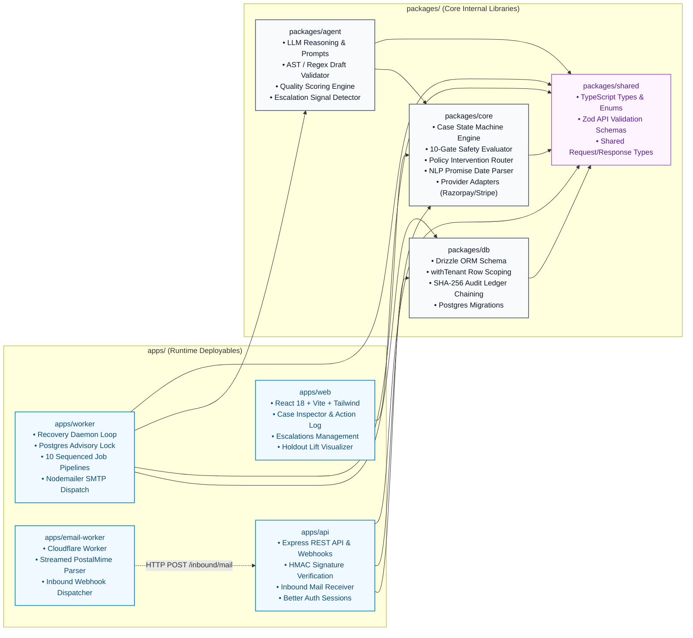
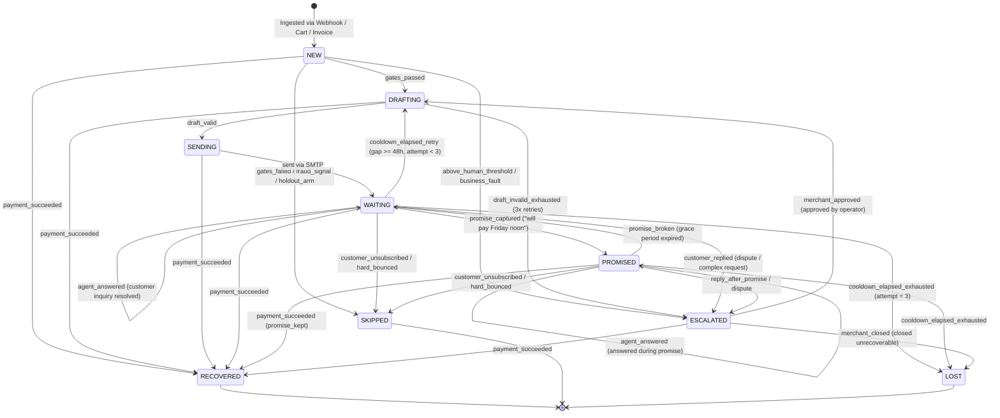
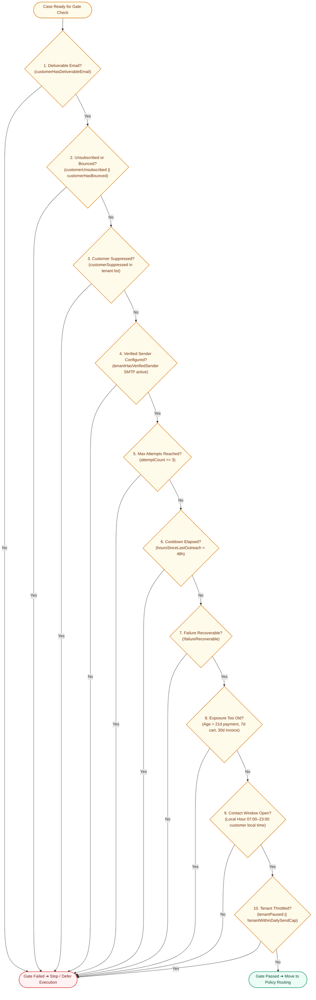
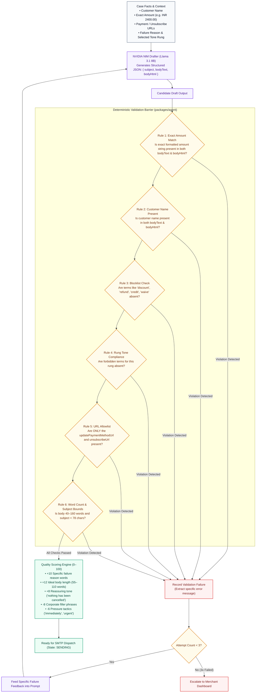
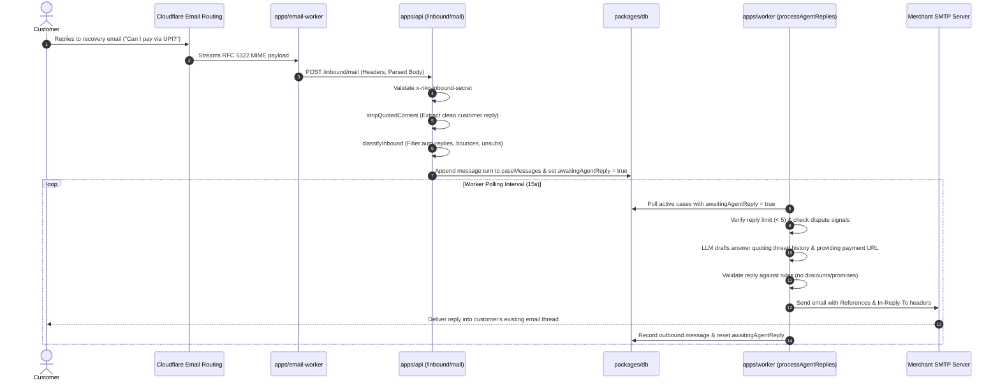
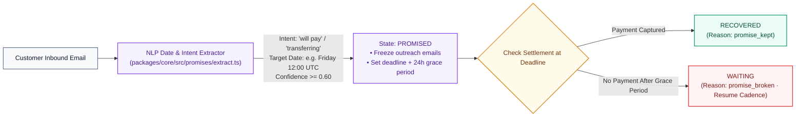
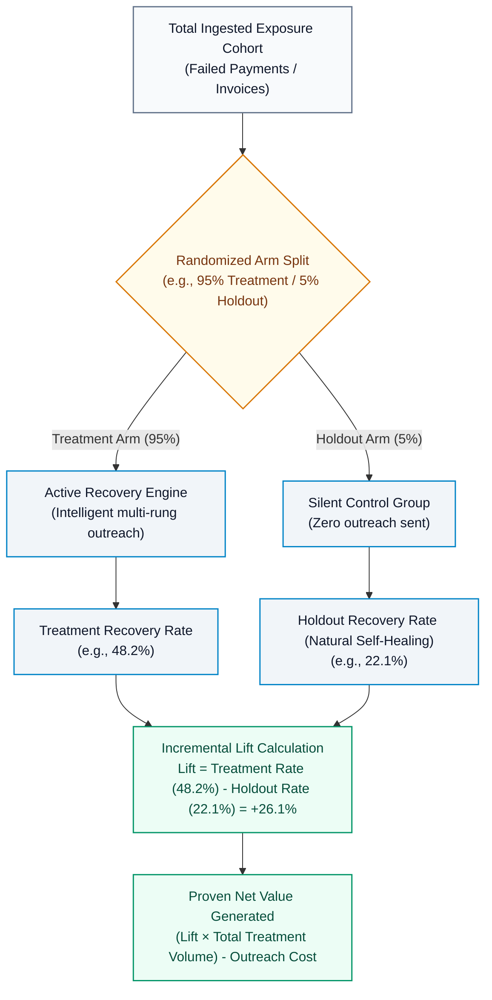
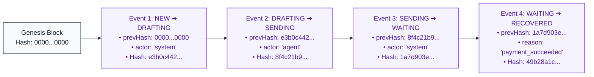

# How Riko Works

Riko is an autonomous revenue recovery engine. It detects payment failures, abandoned checkouts, and overdue receivables, decides whether and when to act, and runs bounded email outreach to recover funds.

---

## 1. System Topology & Lifecycle Overview

Riko separates recovery policy from message generation. A deterministic policy engine evaluates limits and safety bounds, while an LLM reasoning engine drafts messages within structured templates. Every draft is evaluated by a post-generation validation pass before dispatch.

```mermaid
flowchart TB
    %% Class Styles
    classDef ext fill:#f8fafc,stroke:#64748b,stroke-width:1.5px,color:#0f172a
    classDef proc fill:#f1f5f9,stroke:#0284c7,stroke-width:1.5px,color:#0f172a
    classDef gate fill:#fffbeb,stroke:#d97706,stroke-width:1.5px,color:#78350f
    classDef agent fill:#f5f3ff,stroke:#7c3aed,stroke-width:1.5px,color:#4c1d95
    classDef success fill:#ecfdf5,stroke:#059669,stroke-width:1.5px,color:#064e3b
    classDef term fill:#fef2f2,stroke:#dc2626,stroke-width:1.5px,color:#7f1d1d

    EVENT(["1. External Trigger\n(Payment Failure · Cart Abandoned · Overdue Invoice)"]):::ext
    
    subgraph IngestStage["Ingestion & Normalization (apps/api)"]
        direction TB
        SIG["HMAC-SHA256 Signature Verification\n(Matches candidate connection secrets)"]:::proc
        NORM["Payload Normalizer ➔ NormalizedEvent\n(Maps gateway error to FailureCategory)"]:::proc
        PII["AES-256-GCM Cryptographic Vault\n(Encrypts customer email & phone at rest)"]:::proc
        ARM{"Assign Experimental Arm\n(e.g., 95% Treatment / 5% Holdout)"}:::gate
    end

    subgraph GateStage["Deterministic Gate Evaluator (packages/core)"]
        direction TB
        GATES{"10 Hard Send Gates Check\n• Deliverable Email · Not Suppressed/Bounced\n• Sender Verified · Attempt Count < 3\n• Cooldown >= 48h · Contact Window (7–23h)\n• Max Exposure Age · Tenant Daily Cap"}:::gate
    end

    subgraph PolicyStage["Intervention Policy Router (packages/core)"]
        direction TB
        ROUTER{"Evaluate Intervention Policy"}:::gate
        STOP_F["Fraud Signal Detected?\n(lost_card, stolen_card, security_violation)"]:::gate
        ESC_T["High Value / Business Fault?\n(amount >= humanReviewMinor OR merchant setup error)"]:::gate
        WAIT_R["Provider Retrying or Soft Decline?\n(network_error or within retry window)"]:::gate
        OUT_R["Actionable Recovery Outreach\n(Selects tone rung: instrument_fix, reminder, etc.)"]:::gate
    end

    subgraph AgentStage["AI Reasoning & Validation Barrier (packages/agent)"]
        direction TB
        REASON["LLM Reasoner (NVIDIA NIM · Llama 3.1 8B)\nEvaluates case context & customer history"]:::agent
        DRAFT["Structured Email Drafter\nGenerates { subject, bodyText, bodyHtml }"]:::agent
        VALID{"Deterministic AST/Regex Validator\n• Exact formatted amount & customer name\n• Zero blocklisted terms (discount, refund, waive)\n• Permitted URLs ONLY (pay & unsub links)\n• Word count [40, 160] & subject < 78 chars"}:::gate
        RETRY{"Retry Count < 3?"}:::gate
        SCORE["Quality Scorer (0–100 Rating)\nRewards clarity & tone; penalizes pressure & filler"]:::agent
    end

    subgraph DispatchStage["Dispatch & Ledger Commitment (apps/worker)"]
        direction TB
        DISPATCH["SMTP Dispatch (Nodemailer)\n• Custom Message-ID · List-Unsubscribe One-Click\n• Branded HTML & plain-text multipart"]:::proc
        LEDGER["SHA-256 Audit Ledger Append\nComputes chained event hash and commits transition"]:::proc
    end

    subgraph TwoWayStage["Two-Way Inbound & Promise Engine"]
        direction TB
        INB_RECV["Inbound Mail Webhook (Cloudflare)\n• Strip quoted reply thread · Classify message type"]:::proc
        PROMISE_TEST{"Customer Intent Classification"}:::gate
        PROM_STATE["PROMISED State\nFreeze outreach until promised date + 24h grace"]:::proc
        CONV_REP["Contextual Agent Reply\nMulti-turn grounded Q&A (max 5 replies)"]:::agent
    end

    subgraph Outcomes["Resolution States"]
        REC(["RECOVERED\n(Payment captured & incremental lift recorded)"]):::success
        SKIP(["SKIPPED\n(Holdout control / Fraud stop / Unsubscribed)"]):::term
        ESC(["ESCALATED\n(Human operator review queue)"]):::term
        LOST(["LOST\n(Attempts exhausted without payment)"]):::term
    end

    %% Pipeline flow
    EVENT --> SIG --> NORM --> PII --> ARM
    ARM -- "Holdout Control Arm" --> SKIP
    ARM -- "Treatment Arm" --> GATES

    GATES -- "Failed (Quiet hours, Cooldown, Daily cap)" --> SKIP
    GATES -- "Passed" --> ROUTER

    ROUTER --> STOP_F
    STOP_F -- "Yes (Fraud)" --> SKIP
    STOP_F -- "No" --> ESC_T
    ESC_T -- "Yes" --> ESC
    ESC_T -- "No" --> WAIT_R
    WAIT_R -- "Yes" --> WAIT_STATE["WAITING State\n(Defer until retry timestamp)"]:::proc
    WAIT_R -- "No" --> OUT_R

    OUT_R --> REASON --> DRAFT --> VALID
    VALID -- "Failed" --> RETRY
    RETRY -- "Yes (< 3x)" -->|Structured Error Feedback| DRAFT
    RETRY -- "No (3x Failed)" --> ESC
    VALID -- "Passed" --> SCORE --> DISPATCH --> LEDGER

    LEDGER --> INB_RECV --> PROMISE_TEST
    PROMISE_TEST -- "Promise to Pay Extracted" --> PROM_STATE
    PROMISE_TEST -- "Customer Question" --> CONV_REP --> DISPATCH
    PROMISE_TEST -- "No Reply (48h elapsed)" --> GATES

    %% Resolutions
    PROM_STATE -- "Paid on/before Due Date" --> REC
    PROM_STATE -- "Promise Broken" --> GATES
    DISPATCH -.->|Webhook: payment.captured| REC
    GATES -- "Attempts >= 3" --> LOST
```

---

## 2. Core Monorepo Architecture



---

## 3. Case State Machine

Cases move through a finite state machine enforced by [`packages/core/src/cases/state-machine.ts`](./packages/core/src/cases/state-machine.ts).



### Terminal States
- `RECOVERED`: The payment was captured and verified.
- `SKIPPED`: Case halted due to hard bounce, unsubscribe, fraud signal, or control group assignment.
- `ESCALATED`: Routed to merchant review due to high value, dispute, or validation failure.
- `LOST`: Maximum outreach attempts exhausted without recovery.

---

## 4. Send Gates & Policy Engine

Before any draft is generated, [`packages/core/src/gates/evaluate.ts`](./packages/core/src/gates/evaluate.ts) executes hard safety checks:



---

## 5. Reasoning, Drafting & Validation



### Communication Tone Rungs
- `instrument_fix`: Friendly notification for soft declines, expired cards, or authentication issues.
- `resume_checkout`: Cart abandonment nudge with a saved checkout link (no debt framing).
- `reminder`: First gentle reminder for overdue invoices.
- `firm`: Professional follow-up on persistent unpaid invoices.
- `formal`: Late-stage invoice notice stating outstanding amounts plainly.
- `merchant_fault`: Transparent notice for merchant gateway configuration issues.

---

## 6. Two-Way Email & Conversation Threading



---

## 7. Promise-to-Pay Intelligence

Customers often reply with scheduled commitments (*"I'll pay on Monday"* or *"Will clear this tomorrow by 5pm"*).



---

## 8. Incremental Lift & Attribution

To distinguish true agent impact from natural self-healing, Riko uses randomized holdout control groups:



---

## 9. Cryptographic Audit Ledger

Every case state transition and LLM interaction appends to a SHA-256 hash chain:

$$\text{hash}_n = \text{SHA-256}\Big(\big[\text{prevHash}, \text{caseId}, \text{fromState}, \text{toState}, \text{reason}, \text{actor}, \text{createdAt}\big]\Big)$$



- **Genesis Hash**: Initial event starts with $64\text{ zeros}$.
- **Verification**: Integrity can be validated programmatically via `/api/cases/:caseId/audit` or exported to CSV. Any manual database tampering breaks the hash chain.

---

## 10. Security & Multi-Tenancy

- **Row-Level Tenant Isolation**: All queries execute within `withTenant(db, tenantId, ...)` scoping.
- **PII Encryption**: Customer emails and phone numbers are encrypted at rest with `AES-256-GCM`.
- **Constant-Time Comparisons**: Security tokens and inbound webhook secrets use `crypto.timingSafeEqual`.
- **Session Authentication**: Handled by Better Auth with secure HTTP-only cookies.
