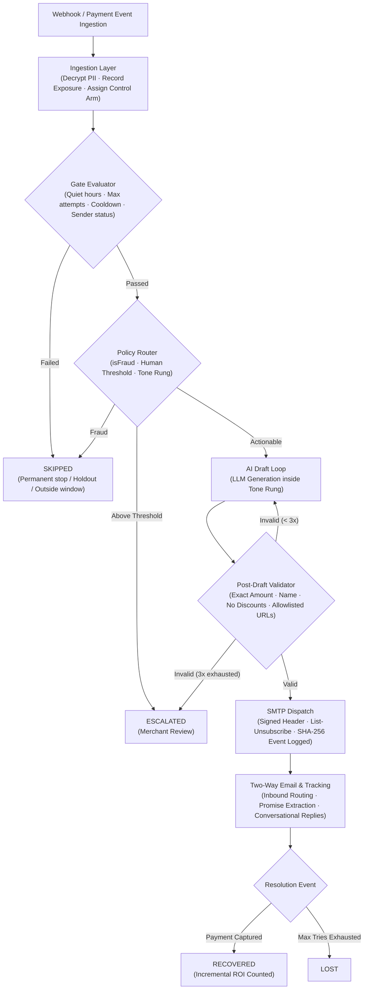
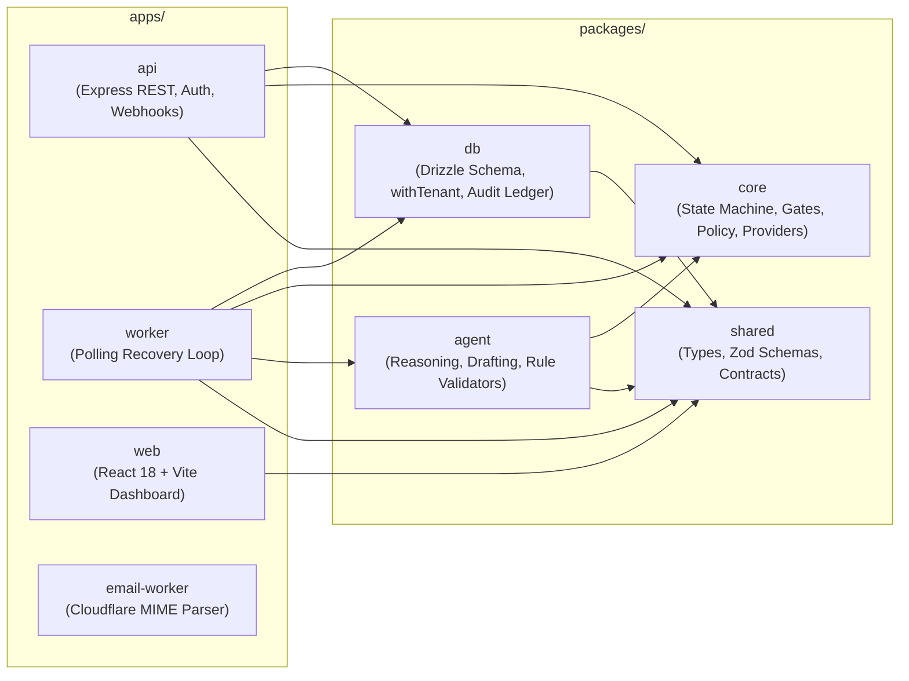
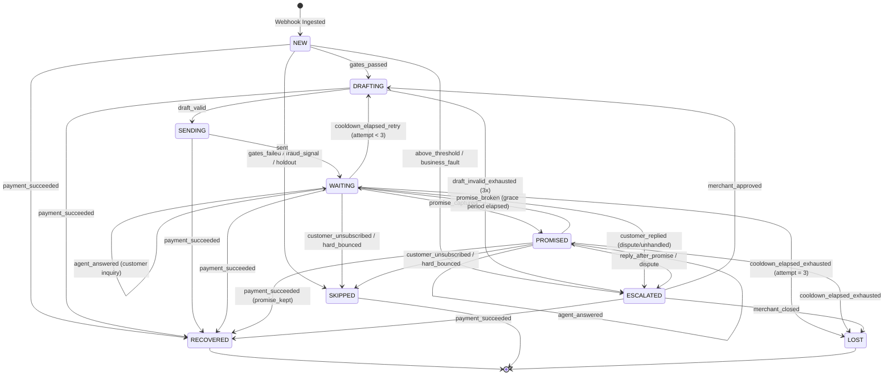
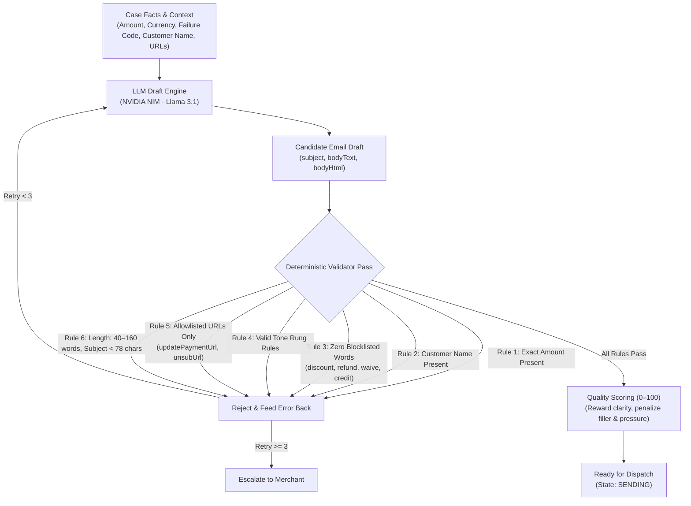
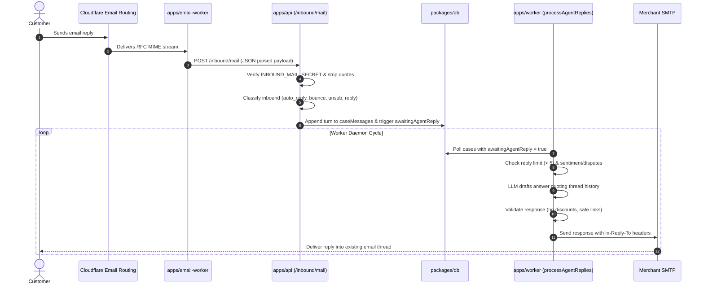
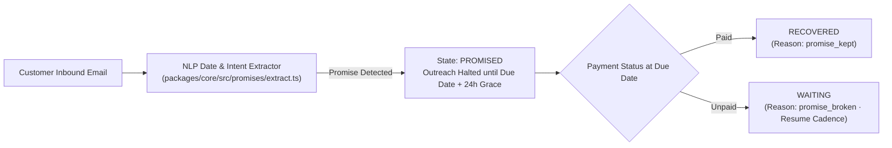
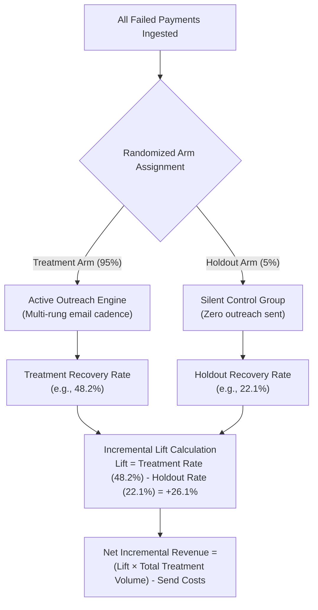
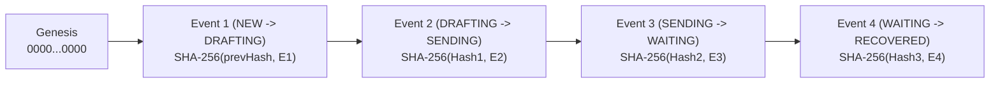

# How Riko Works

Riko is an autonomous revenue recovery engine. It detects payment failures, abandoned checkouts, and overdue receivables, decides whether and when to act, and runs bounded email outreach to recover funds.

---

## 1. System Overview

Riko separates recovery policy from email drafting. A deterministic policy engine evaluates limits and safety bounds, while an LLM reasoning engine drafts messages within structured templates. Every draft is evaluated by a post-generation validation pass before dispatch.

---

## 2. Core Monorepo Architecture

---

## 3. Case State Machine

Cases move through a finite state machine enforced by [`packages/core/src/cases/state-machine.ts`](./packages/core/src/cases/state-machine.ts).

### Terminal States
- `RECOVERED`: The payment was captured and verified.
- `SKIPPED`: Case halted due to hard bounce, unsubscribe, fraud signal, or control group assignment.
- `ESCALATED`: Routed to merchant review due to high value, dispute, or validation failure.
- `LOST`: Maximum outreach attempts exhausted without recovery.

---

## 4. Send Gates & Policy Engine

Before any draft is generated, [`packages/core/src/gates/evaluate.ts`](./packages/core/src/gates/evaluate.ts) executes hard safety checks:

| Gate | Rule | Behavior on Failure |
|---|---|---|
| **Deliverability** | Customer must possess a valid, non-empty email address | SKIPPED (`no_deliverable_email`) |
| **Suppression** | Customer must not be unsubscribed, bounced, or suppressed | SKIPPED (`unsubscribed_or_bounced`) |
| **Verified Sender** | Merchant must configure an active, verified SMTP identity | Defer until sender is verified |
| **Max Attempts** | Hard cap of 3 outreach emails per case | LOST (`attempts_exhausted`) |
| **Cooldown** | Minimum 48-hour gap between successive emails | Defer until cooldown elapses |
| **Contact Window** | Follow-up emails only send between 07:00–23:00 local time | Defer until contact window opens |
| **Exposure Age** | Max age: 21d (payments), 7d (carts), 30d (invoices) | SKIPPED (`payment_too_old`) |
| **Daily Send Cap** | Tenant-level send volume throttle | Defer until cap window resets |
| **Fraud Check** | Compromised/stolen card signals (`lost_card`, `fraudulent`) | SKIPPED (`fraud_signal`) |

---

## 5. Reasoning, Drafting & Validation

### Communication Tone Rungs
- `instrument_fix`: Friendly notification for soft declines, expired cards, or authentication issues.
- `resume_checkout`: Cart abandonment nudge with a saved checkout link (no debt framing).
- `reminder`: First gentle reminder for overdue invoices.
- `firm`: Professional follow-up on persistent unpaid invoices.
- `formal`: Late-stage invoice notice stating outstanding amounts plainly.
- `merchant_fault`: Transparent notice for merchant gateway configuration issues.

---

## 6. Two-Way Email & Conversation Threading

---

## 7. Promise-to-Pay Intelligence

Customers often reply with scheduled commitments (*"I'll pay on Monday"* or *"Will clear this tomorrow by 5pm"*).

---

## 8. Incremental Lift & Attribution

To distinguish true agent impact from natural self-healing, Riko uses randomized holdout control groups:

---

## 9. Cryptographic Audit Ledger

Every case state transition and LLM interaction appends to a SHA-256 hash chain:

$$\text{hash}_n = \text{SHA-256}\Big(\big[\text{prevHash}, \text{caseId}, \text{fromState}, \text{toState}, \text{reason}, \text{actor}, \text{createdAt}\big]\Big)$$

- **Genesis Hash**: Initial event starts with $64\text{ zeros}$.
- **Verification**: Integrity can be validated programmatically via `/api/cases/:caseId/audit` or exported to CSV. Any manual database tampering breaks the hash chain.

---

## 10. Security & Multi-Tenancy

- **Row-Level Tenant Isolation**: All queries execute within `withTenant(db, tenantId, ...)` scoping.
- **PII Encryption**: Customer emails and phone numbers are encrypted at rest with `AES-256-GCM`.
- **Constant-Time Comparisons**: Security tokens and inbound webhook secrets use `crypto.timingSafeEqual`.
- **Session Authentication**: Handled by Better Auth with secure HTTP-only cookies.
